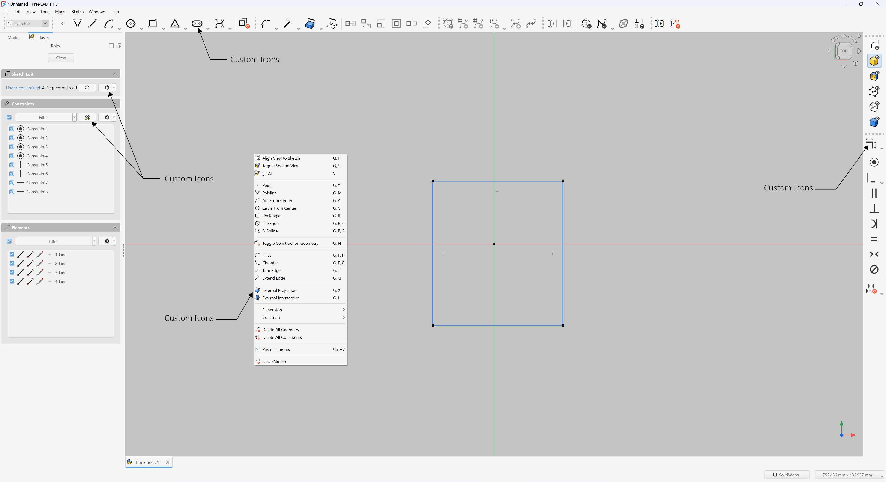
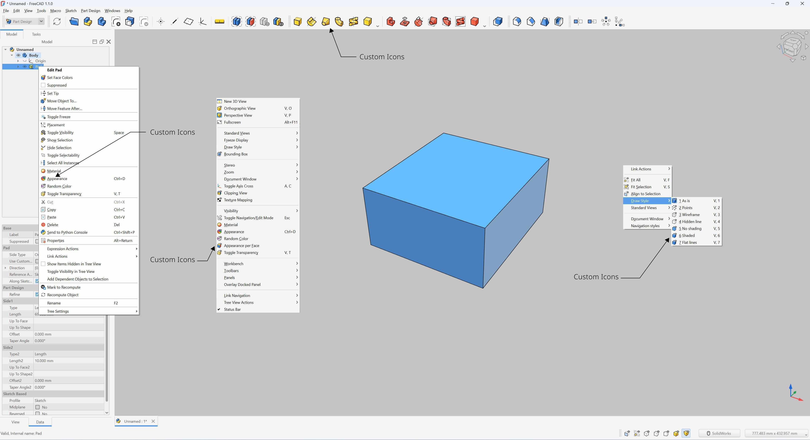

# FreeCAD Complete External Icon Coverage

Contribution fork focused on extending **FreeCAD’s external icon theme support** across GUI areas that are not fully covered by upstream’s current implementation.

This fork is maintained as a **clean PR preparation branch** for upstream contribution to the main FreeCAD project.

---

## Project Goal

FreeCAD already supports external icon themes in many areas, but some important GUI surfaces still fall back to built-in resources.

The goal of this fork is to provide **complete external icon coverage** so that icon themes can consistently override all major GUI surfaces.

This work extends external icon support to:

- Main toolbars
- Workbench toolbar icons
- Workbench dropdown icons
- Sketcher task panel icons
- Task solver panel icons
- Document tab icons
- 3D view related fallback icon paths
- Runtime-generated package / workbench icons

---

## Current Patch Scope

The current implementation modifies the following upstream source files:

- `src/Gui/BitmapFactory.cpp`
- `src/Gui/BitmapFactory.h`
- `src/Gui/FreeCADGuiInit.py`
- `src/Gui/TaskView/TaskSolverMessages.cpp`
- `src/Gui/View3DInventor.cpp`
- `src/Mod/Sketcher/Gui/TaskSketcherConstraints.cpp`
- `src/Mod/Sketcher/Gui/TaskSketcherElements.cpp`

These changes are intentionally limited to icon lookup / runtime icon application behavior.

No unrelated GUI logic is modified.

---

## Design Philosophy

This contribution intentionally follows a **flat filename-based theme override model**.

Example:

```text
:/icons/Sketcher_Constraint.svg
→ ThemeFolder/Sketcher_Constraint.svg
```

---

### Sketcher + Document Tab Icons


### Main Toolbar + Workbench Icons



