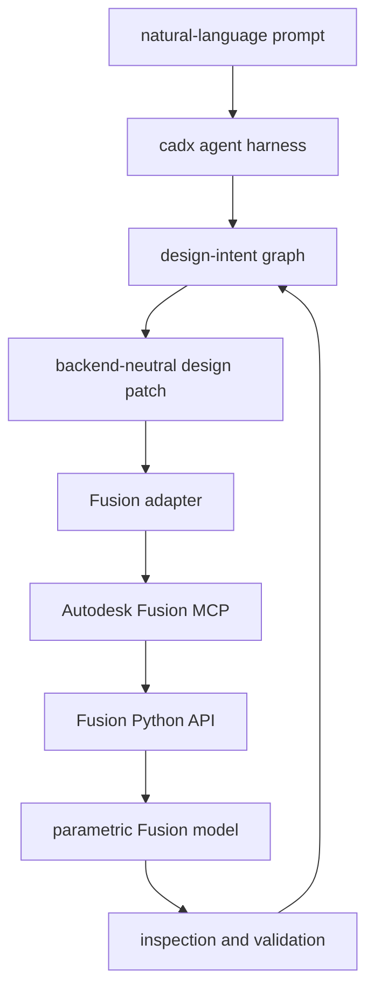
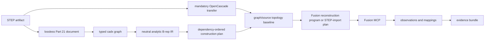

# cadx

**prompt-native cad.**

cadx is an ai-native cad harness that turns design intent into validated parametric models.

Autodesk Fusion is the first geometry backend and visual environment, accessed through its official MCP server and Python API. cadx maintains its own backend-neutral representation of design intent so the system can eventually support—or become—a standalone cad runtime.

## why cadx?

traditional cad systems are designed around direct manipulation: selecting faces, opening dialogs, and editing feature timelines by hand.

ai-native cad needs a different control layer:

- structured design intent
- semantic references to parts and features
- deterministic operations
- geometric validation
- revision and recovery mechanisms
- iterative inspect–modify–verify loops
- portability across geometry backends

cadx provides that layer.

## architecture


```mermaid
flowchart TD
    P["natural-language prompt"] --> H["cadx agent harness"]
    H --> G["design-intent graph"]
    G --> D["backend-neutral design patch"]
    D --> A["Fusion adapter"]
    A --> M["Autodesk Fusion MCP"]
    M --> API["Fusion Python API"]
    API --> F["parametric Fusion model"]
    F --> V["inspection and validation"]
    V --> G
```

Fusion owns evaluated geometry, rendering, the feature timeline, assemblies, and exported artifacts.

cadx owns requirements, semantic design intent, operation history, validation rules, and backend-independent modeling plans.

STEP ingestion follows a stricter path because imported parts must remain useful
outside Fusion:


```mermaid
flowchart LR
    S["STEP artifact"] --> P["lossless Part 21 document"]
    P --> G["typed cadx graph"]
    G --> IR["neutral analytic B-rep IR"]
    IR --> DP["dependency-ordered construction plan"]
    S --> O["mandatory OpenCascade transfer"]
    O --> X["graph/source topology baseline"]
    DP --> X
    X --> FP["Fusion reconstruction program or STEP-import plan"]
    FP --> MCP["Fusion MCP"]
    MCP --> OBS["observations and mappings"]
    OBS --> E["evidence bundle"]
```

The Part 21 graph preserves products, occurrences, topology, source spans, and
unsupported entities. A versioned neutral reconstruction IR is decoded from the
serialized graph alone and dependency-ordered from points through solids.
OpenCascade independently proves that the source can be transferred into B-rep
topology and provides the current parity baseline. Fusion is an adapter after
those checks, not the owner of the imported representation. The current live
path still uses STEP import; the graph-derived Fusion program is emitted as
debug evidence until its `BRepBodyDefinition` script emitter is complete.

## example

a request such as:

> create an 80 × 50 × 6 mm mounting plate with four M4 clearance holes, preserving 8 mm edge offsets.

becomes a structured design patch describing:

- named parameters
- sketch geometry
- dimensional constraints
- feature operations
- semantic entities
- expected measurements
- validation conditions

the Fusion adapter compiles that patch into Python API operations, executes it through Fusion’s MCP server, inspects the result, and either commits the revision or repairs the design.

## design principles

- **intent is persistent.** designs retain requirements and relationships, not just final geometry.
- **geometry is verified.** every meaningful operation should produce machine-checkable evidence.
- **references are semantic.** agents refer to `mounting_face` and `bolt_pattern`, not fragile face indices.
- **operations are recoverable.** changes are revisioned, validated, and reversible.
- **backends are replaceable.** Fusion-specific identifiers and API calls remain inside the Fusion adapter.
- **prompts are the primary interface.** the system does not depend on manual cad editing.

## initial scope

the first cadx runtime will:

- connect to the official Autodesk Fusion MCP server
- inspect the active Fusion document
- maintain a normalized design-intent graph
- generate and execute Fusion Python scripts
- create and modify parametric parts
- resolve semantic references to Fusion entities
- measure and validate resulting geometry
- capture visual verification
- record revisions and recover from failures

## long-term direction

cadx will gradually separate ai-driven design from any single cad application.

future backends may provide their own:

- geometry kernel
- sketch constraint solver
- parametric feature evaluator
- assembly system
- renderer
- import and export pipeline

designs expressed through the portable cadx representation should remain reproducible as those backends evolve.

## status

cadx is in early development. interfaces, schemas, and modeling conventions will change rapidly while the first end-to-end workflows are established.

## development

- [testing strategy](docs/testing.md)
- [architecture and crate boundaries](docs/architecture.md)
- [debugging ingestion failures](docs/debugging.md)
- [STEP fixture corpus](tests/fixtures/step/README.md)

The first native build compiles OpenCascade and requires Rust plus CMake. On
macOS with Homebrew:

```sh
brew install rust cmake
cargo test --workspace
```

Compile a plan and evidence bundle without changing Fusion:

```sh
cargo run -p cadx-cli -- ingest \
  tests/fixtures/step/valid/ap214-simple-solid.stp \
  --fusion plan
```

Exercise the complete protocol against the deterministic mock:

```sh
cargo run -p cadx-cli -- ingest \
  tests/fixtures/step/valid/ap214-simple-solid.stp \
  --fusion mock
```

Live Fusion execution is explicit:

```sh
cargo run -p cadx-cli -- ingest part.step \
  --fusion live \
  --endpoint http://127.0.0.1:27182/mcp
```

On Fusion 2704, an untagged source is imported into a new unsaved design because
the existing-component STEP APIs currently return an internal validation error.
An already tagged imported design is reused and reconciled without duplication.
