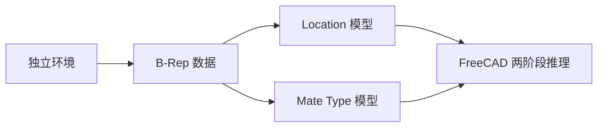
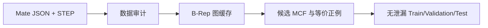
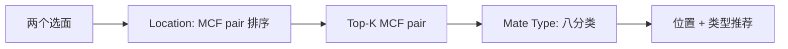
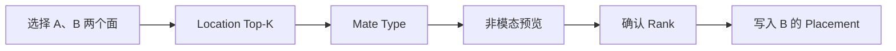
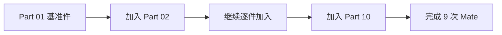

# AutoMate 复现验证

## 1. 复现目标

本次复现完成了从 AutoMate 数据处理、两个独立模型训练，到 FreeCAD 选面装配的基本闭环。



论文原理参见：[论文路线分析](论文路线分析.md)。

## 2. 环境与构建

AI 运行环境与 FreeCAD 自身 Python 分离，FreeCAD 通过子进程调用 AutoMate，避免 Python ABI 和依赖冲突。

| 组件 | 配置 |
|---|---|
| Python | 3.10 |
| PyTorch | 2.7.1 |
| CUDA Runtime | 12.8 |
| PyTorch Geometric | 2.6.x |
| OCCT | 7.8.x |
| 环境管理 | pixi |

同一环境兼容 RTX 2060 SUPER（`sm_75`）和 RTX 5060 系列（`sm_120`）。PyTorch wheel 自带 CUDA Runtime，但主机需要满足 CUDA 12.8 要求的 NVIDIA 驱动。

```powershell
pixi run check
pixi run build-cpp
pixi run check-cpp
```

`automate_cpp` 使用 OCCT 读取 STEP/B-Rep，并把面、边、点及其拓扑关系转换为模型使用的图数据。

## 3. 数据处理



数据处理遵循以下原则：

- 已完成的图缓存可复用，中断后无需重新处理；
- 按文档、装配体和零件关系划分，避免数据泄漏；
- Location 支持多个几何等价正例；
- 无法召回真实 MCF 的样本不进入正式训练。

最终使用两套独立数据：

| 任务 | 有效样本 | 训练输入 |
|---|---:|---|
| Mate Type | 9,384 | 两个零件和真实 MCF pair |
| Location | 262,625 | 两个零件、两个选面和局部候选 MCF pair |

Location 数据划分为 209,290 条 Train、26,657 条 Validation 和 26,678 条 Test。

## 4. 模型训练

当前使用两个独立的 6 层 SB-GCN：



### 4.1 Mate Type

| 项目 | 结果 |
|---|---:|
| 训练 Epoch | 50 |
| 最优 checkpoint | Epoch 8 |
| Test 样本 | 971 |
| Accuracy | 54.07% |
| Top-3 | 89.19% |
| Balanced Accuracy | 27.25% |
| Macro F1 | 25.08% |

结果说明 Top-3 推荐具有较高覆盖率，但类别不平衡问题明显。稀有 Mate 和训练分布外零件仍可能出现高置信度误判。

冻结清单：[Mate Type FROZEN.json](../runs/paper_mate_type_10000_e50/FROZEN.json)。

### 4.2 Location

| 项目 | 结果 |
|---|---:|
| 训练 Epoch | 30 |
| 最优 checkpoint | Epoch 7 |
| Test 样本 | 26,678 |
| Top-1 | 58.76% |
| Top-5 | 75.85% |
| MRR | 66.54% |
| Mean Rank | 21.71 |

Location 以 Validation MRR 选择最优模型。后期 Train 指标继续提高，但 Validation MRR 没有同步提高，因此正式推理使用 epoch 7 的 `best.pt`。

冻结清单：[Location FROZEN.json](../runs/paper_location_full_e30/FROZEN.json)。

验证冻结产物：

```powershell
pixi run verify-mate-type-frozen
pixi run verify-location-frozen
```

## 5. FreeCAD 推理验证



在 FreeCAD Python 控制台执行：

```python
exec(open(r"D:\freecad\FreeCAD\aimodule\automate\freecad_mate_prediction.py", encoding="utf-8").read())
```

当前已经实现：

- 分别选择两个零件的一个面；
- 返回 Location Top-K 和每个候选的 Mate Type；
- 使用非模态窗口切换 Rank 并观察位置；
- OK 提交、Cancel 恢复、`Ctrl+Z` 撤销；
- 处理普通对象和 Assembly/App::Link 坐标；
- 对圆柱面提供可选轴向接触修正。

Assembly 坐标处理使用以下顺序：

```text
源 Shape 局部 MCF
→ A 的全局 MCF
→ B 的目标全局 Placement
→ 父 Assembly 逆变换
→ B Link 的相对 Placement
```

该转换已通过 B-pillar 与 Clip 验证，解决了 MCF 已对齐但实体位置错误的问题。

## 6. 连续装配验证

已从 Validation 中准备同一装配体的 10 个零件和 9 条真实 Mate，用于逐个加入零件，而不是五个互不相关的零件对。



- 加载脚本：[freecad_load_validation_sequence.py](../freecad_load_validation_sequence.py)
- 装配清单：[manifest.json](../dataset/demo/location_validation_sequence_10/manifest.json)

## 7. 当前结论与下一步

本次已经完成：

- 独立环境和 `automate_cpp`；
- 无泄漏数据与可复用图缓存；
- 独立 Location 和 Mate Type 正式训练；
- Test 评估、checkpoint 冻结和哈希；
- FreeCAD Top-K 选面推理；
- 普通零件及 Assembly Link 的静态 Placement。

当前仍属于“配合推荐 + 静态放置”，尚未自动创建持续生效的 FreeCAD Joint。下一步包括：

1. 根据预测 Mate Type 创建 Assembly Joint；
2. 为 REVOLUTE 增加可靠的轴向定位方式；
3. 解决非轴对称零件绕轴角度不唯一；
4. 使用实际工业零件评估域外泛化并进行微调。

总体测试结果表明，Location Top-5 为 75.85%，Mate Type Top-3 为 89.19%，适合采用 Top-K 人机确认；但单一最高分结果仍不能直接替代设计者确认和 CAD 几何约束。
