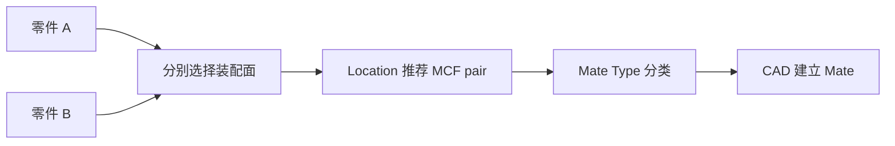
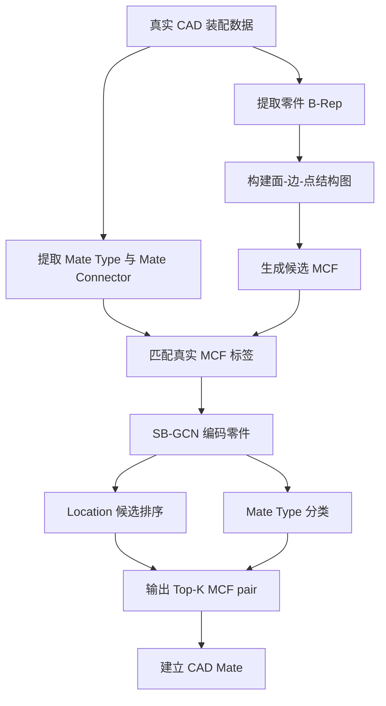
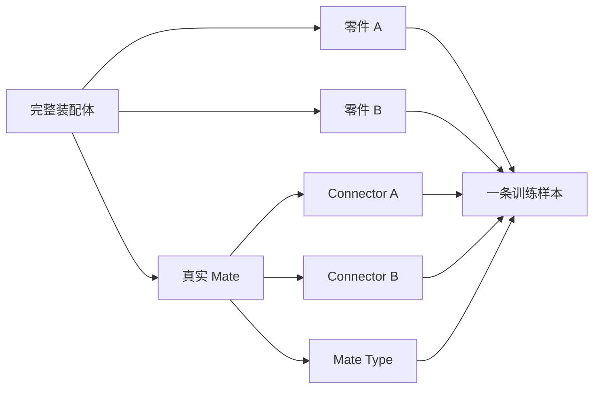
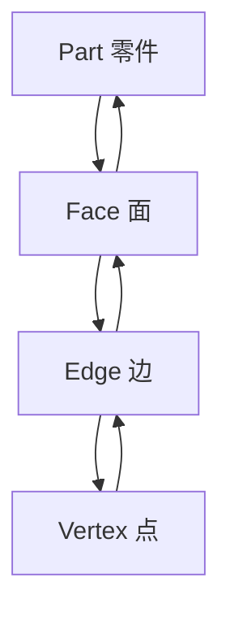
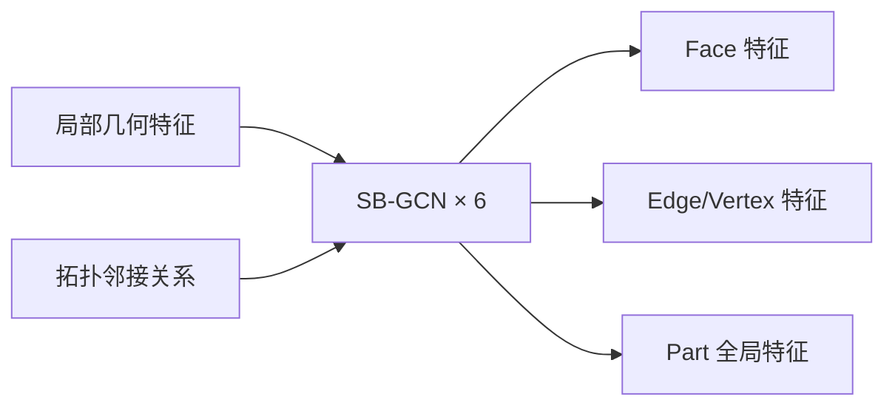
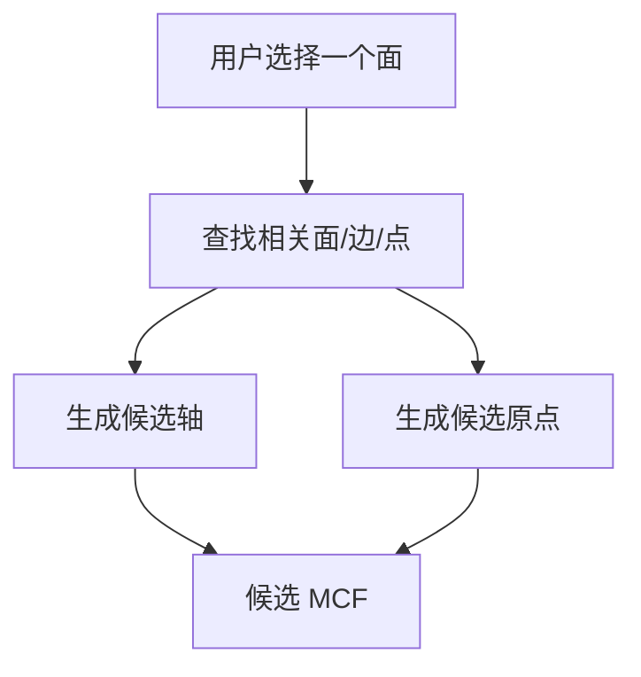
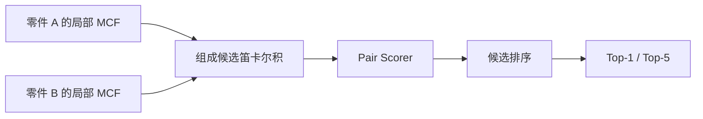
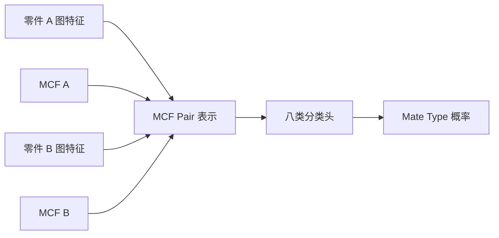
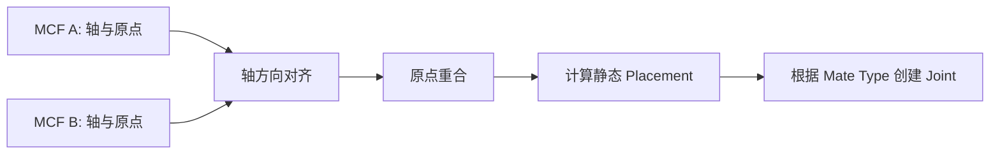
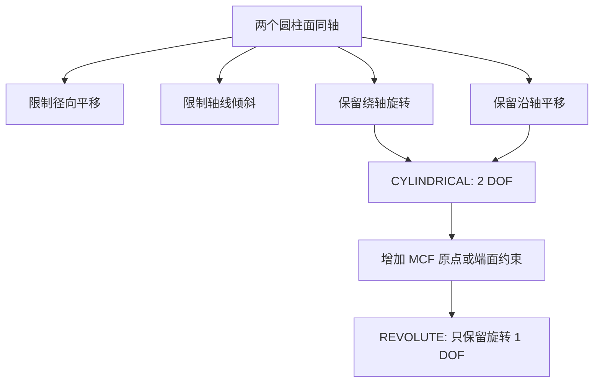

# AutoMate 论文路线分析

## 1. 论文解决什么问题

AutoMate 用于辅助建立 CAD 零件之间的 Mate。用户选择两个待装配零件及其装配面，系统推荐：

- **Mate Location**：两侧应使用哪一对 Mating Coordinate Frame（MCF）；
- **Mate Type**：应建立哪一种配合关系。




## 2. 总体技术路线



核心思想是：

> 先用 CAD 几何规则生成有限候选，再用图神经网络学习设计者的装配意图。

## 3. 数据集

论文从已经完成的真实 CAD 装配中提取监督数据。



数据覆盖八类 Mate：

| Mate Type | 基本含义 |
|---|---|
| FASTENED | 固定相对位姿 |
| REVOLUTE | 只允许绕轴旋转 |
| SLIDER | 只允许沿轴平移 |
| CYLINDRICAL | 允许沿轴平移和绕轴旋转 |
| PLANAR | 保持平面关系 |
| BALL | 围绕固定中心旋转 |
| PIN_SLOT | 销在槽中运动 |
| PARALLEL | 保持指定方向平行 |

不同类型的样本数量不均衡，因此评估不能只看总体 Accuracy，还应观察各类别召回率。

## 4. B-Rep 与 SB-GCN

AutoMate 不只使用点云或三角网格，而是保留 CAD 的精确 B-Rep 结构：



B-Rep 图包含：

- Face、Edge、Vertex 和 Part 节点；
- 面、边、点之间的边界与邻接关系；
- 曲面类型、几何属性和局部采样特征。

论文使用 SB-GCN 在不同拓扑实体之间传播信息。主要实验采用 6 层网络，使选面和候选 MCF 同时获得局部结构与整个零件的上下文。



两个零件使用共享权重的 SB-GCN 编码器：

$$
H_A=f_\theta(G_A),\qquad H_B=f_\theta(G_B)
$$

## 5. Mating Coordinate Frame

MCF 用于描述零件上的候选装配位置：

$$
M=(\mathbf a,\mathbf o)
$$

- $\mathbf a$：装配主轴方向；
- $\mathbf o$：装配原点。

候选 MCF 可从平面、圆柱面、圆边、边界中心或顶点等 CAD 几何中推导。



用户选面会限制候选范围。设两侧候选分别为：

$$
\mathcal M_A(F_A),\qquad \mathcal M_B(F_B)
$$

Location 的搜索空间是：

$$
\mathcal C=\mathcal M_A(F_A)\times\mathcal M_B(F_B)
$$

## 6. Mate Location

Location 模型不直接回归零件位姿，而是给每个候选 MCF pair 打分：

$$
s_{ij}=g(z_A^i,z_B^j)
$$



同一真实 Mate 可能存在多个几何等价 MCF，因此 Location 应允许多正例。常用指标包括：

- Top-1；
- Top-K；
- MRR；
- Mean Rank。

如果候选生成阶段没有召回真实 MCF，后续网络无法恢复，因此候选召回率是 Location 性能的上限。

## 7. Mate Type

Mate Type 模型在给定 MCF pair 的条件下进行八分类：

$$
p(T\mid G_A,G_B,M_A,M_B)
$$



Location 与 Mate Type 是两个任务，但论文路线不强制必须部署两个完全独立的网络。它们可以共享 SB-GCN，也可以按顺序独立推理。

典型推理顺序是：

```text
Location Top-K MCF pair
→ 分别预测每个 pair 的 Mate Type
→ 返回 Top-K“位置 + 类型”组合
```

## 8. 从预测到 CAD Mate

模型推荐两侧 MCF 后，CAD 系统可以先对齐轴和原点：

$$
R\mathbf a_B=-\mathbf a_A
$$

$$
\mathbf t=\mathbf o_A-R\mathbf o_B
$$



必须区分：

- **MCF Location**：推荐轴和原点；
- **Placement**：把零件移动到一个静态位置；
- **Mate/Joint**：持续限制零件自由度。

模型预测 `REVOLUTE` 并不代表 CAD 已经自动建立了 Revolute Joint。

## 9. Revolute 的轴向约束

两个圆柱面同轴只能确定公共轴，仍保留两个自由度：



论文中的 MCF 原点可以提供轴向位置。实际 CAD 中也可以使用：

- Mate Connector 原点；
- 圆柱端面或轴肩；
- 轴向接触面；
- 显式 offset。

因此，两个圆柱面可以确定旋转轴，但要建立精确 Revolute，还需要限制沿轴平移。

## 10. 多零件装配

AutoMate 按二零件关系逐步扩展装配，不是把十个零件分成五个独立配对。


每轮流程：

1. 从当前装配集合选择一个已有零件；
2. 选择一个待加入的新零件；
3. 分别选择装配面；
4. 推荐 MCF Location 和 Mate Type；
5. 确认并建立 CAD Mate；
6. 将新零件加入当前装配集合。

装配关系可以是链形、树形或一般装配图，新零件不一定只与上一步加入的零件配合。

## 11. 方法优点与局限

| 优点 | 局限 |
|---|---|
| 保留 CAD B-Rep 几何和拓扑 | 依赖候选 MCF 的召回率 |
| 几何规则缩小搜索空间 | 单轴 MCF 不能表达完整绕轴姿态 |
| SB-GCN 同时学习局部与全局结构 | Mate Type 数据类别不均衡 |
| Top-K 适合人机协同确认 | 对训练分布外零件可能高置信度误判 |
| 二元 Mate 可迭代形成多零件装配 | 不负责碰撞、装配顺序和可达性规划 |

## 12. 路线总结


AutoMate 的技术主线是：

> 用 CAD 几何生成可解释的装配候选，用 SB-GCN 学习候选背后的设计意图，再由 CAD 系统执行配合与自由度约束。
