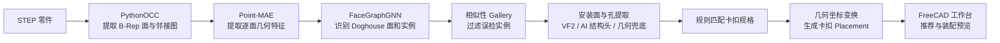
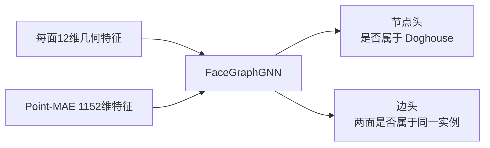

# Doghouse 识别与卡扣装配技术路线简报

## 1. 项目目标

从 STEP 零件中识别 Doghouse（卡扣安装柱），确定安装面与安装孔，推荐卡扣，并在 FreeCAD 中生成卡扣装配预览。

## 2. 总体流程

## 3. 核心技术

### 3.1 STEP 几何处理

PythonOCC 遍历 B-Rep 面，提取面类型、面积、质心、法向、半径、包围盒和采样点，并按共享边构建属性邻接图 AAG。

这一阶段没有使用 AutoMate。

### 3.2 Doghouse 识别

- Point-MAE 编码器被冻结，只负责补充预训练几何特征。
- FaceGraphGNN 使用 4 层 GraphSAGE 式消息传递。
- 节点头识别 Doghouse 面，边头将面划分为不同 Doghouse 实例。
- 实例相似性 Gallery 用于过滤形状不合理的误检。

这一阶段使用本项目自己的模型，没有使用 AutoMate 的 SBGCN、Location 或 Mate Type 模型。

### 3.3 安装面与安装孔提取

优先使用 AAG + MCF-VF2 匹配解析孔；解析孔不可靠时，使用结构 checkpoint 输出的 `mount_prob` 和 `hole_wall_prob`；两者均失败时，再用局部 B-Rep 圆柱聚类兜底。

这里的 **MCF-VF2 不是 AutoMate 的 MCF**：

- 本项目的 MCF 是 VF2 子图搜索中的节点重要性评分，用于决定匹配顺序。
- AutoMate 的 MCF 是 Mate Connector Frame，表示装配轴和装配原点。

因此，本阶段没有调用 AutoMate。

### 3.4 卡扣推荐与装配

系统根据孔径、安装厚度等规则从卡扣库筛选卡扣。选定卡扣后，根据卡扣标注的 `BOLT_CYL` 轴和 `CONTACT` 接触面计算刚体变换：

1. 将卡扣轴旋转到安装孔轴；
2. 将卡扣轴线平移到孔中心；
3. 沿安装面法向修正接触间隙；
4. 把变换矩阵交给 FreeCAD 创建预览对象。

这一阶段有两处明确参考 AutoMate 的实现思想：

- Rodrigues 旋转：把卡扣轴旋转到目标孔轴；
- anchor-based placement：轴对齐后以接触面中心为锚点，贴合局部安装面。

它们只是几何算法层面的借鉴，代码没有调用 AutoMate 模型或模块。

## 4. AutoMate 使用边界

| 模块 | 是否使用 AutoMate | 说明 |
|---|---:|---|
| STEP/B-Rep 特征提取 | 否 | PythonOCC 自主实现 |
| Point-MAE 面特征 | 否 | 使用独立预训练编码器 |
| Doghouse 实例识别 | 否 | 自有 FaceGraphGNN |
| 安装面、孔壁识别 | 否 | 结构 GNN + VF2 + 几何规则 |
| MCF-VF2 | 否 | 与 AutoMate 的 Mate Connector Frame 含义不同 |
| 卡扣规格推荐 | 否 | 基于卡扣库和尺寸规则 |
| 轴对齐与接触贴合 | 部分借鉴 | 参考 AutoMate 的 Rodrigues 和 anchor 思路 |
| FreeCAD 工作台 | 否 | Doghouse 项目独立插件 |

## 5. 结论

Doghouse 项目是一套独立的“特征识别 + 规则选型 + 确定性几何装配”系统。AutoMate 只为最后的坐标变换提供了两处实现参考，没有参与训练、识别、Mate Type 推荐或 Location 推理。
