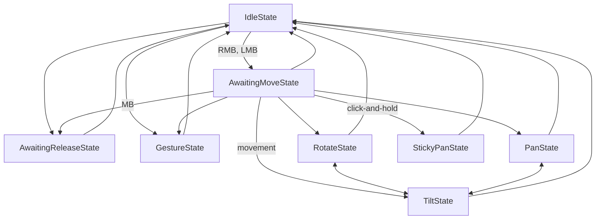

# GestureNavigationStyle State Machine Diagram

```mermaid
flowchart TD
    IdleState --> AwaitingReleaseState
    IdleState --> GestureState
    IdleState --> |RMB, LMB| AwaitingMoveState
    AwaitingReleaseState --> IdleState
    AwaitingMoveState --> |MB| AwaitingReleaseState
    AwaitingMoveState --> IdleState
    AwaitingMoveState --> GestureState
    AwaitingMoveState --> RotateState
    AwaitingMoveState --> PanState
    AwaitingMoveState --> |click-and-hold| StickyPanState
    AwaitingMoveState --> |movement| TiltState
    RotateState <--> TiltState
    PanState <--> TiltState
    TiltState --> IdleState
    StickyPanState --> IdleState
    GestureState --> IdleState
    RotateState --> IdleState
    PanState --> IdleState
```