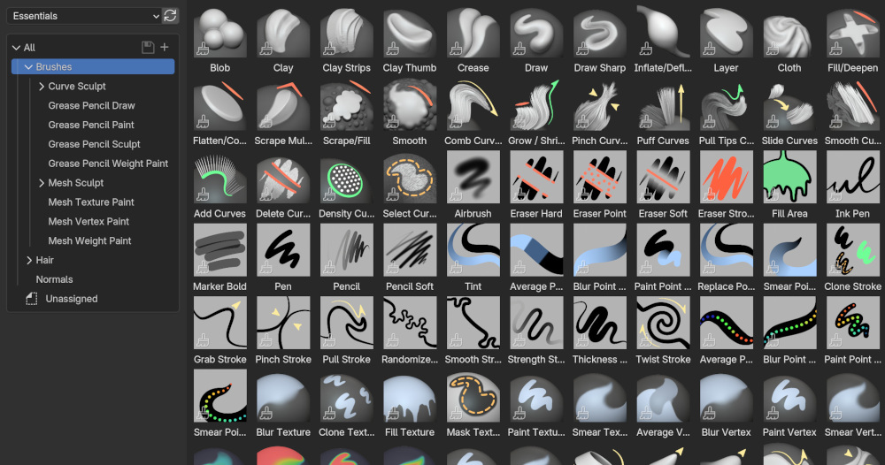

# Asset Management Module

This module implements an asset manager that provides methods for storing,
updating, deleting, and receiving assets for the FreeCAD CAM workbench.

## Goals of the asset manager

While currently the AssetManager has no UI yet, the plan is to add one.

The ultimate vision for the asset manager is to provide a unified UI that
can download assets from arbitrary sources, such as online databases,
Git repositories, and also local storage. It should also allow for copying
between these storages, effectively allowing for publishing assets.

Essentially, something similar to what Blender has:



## What are assets in CAM?

Assets are arbitrary data, such as FreeCAD models, Tools, and many more.
Specifically in the context of CAM, assets are:

- Tool bit libraries
- Tool bits
- Tool bit shape files
- Tool bit shape icons
- Machines
- Fixtures
- Post processors
- ...

**Assets have dependencies:** For example, a ToolBitLibrary requires ToolBits,
and a ToolBit requires a ToolBitShape (which is a FreeCAD model).


## Functionality

The generic AssetManager:

- **Manages storage** while existing FreeCAD tool library file structures retained
- **Manages dependencies** including detection of cyclic dependencies, deep vs. shallow fetching
- **Manages threading** for asynchronous storage, while FreeCAD objects are assembled in the main UI thread
- **Defining a generic asset interface** that classes can implement to become "storable"
- **Defines a generic serializer protocol** A unified serialization protocol allows for generic import/export mechanisms for all assets


## Asset Manager API usage example

```python
import pathlib
from typing import Any, Mapping, List, Type
from Path.Tool.assets import AssetManager, FileStore, AssetUri, Asset

# Define a simple Material class implementing the Asset interface
class Material(Asset):
    asset_type: str = "material"

    def __init__(self, name: str):
        self.name = name

    def get_id() -> str:
        return self.name.lower().replace(" ", "-")

    @classmethod
    def dependencies(cls, data: bytes) -> List[AssetUri]:
        return []

    @classmethod
    def from_bytes(cls, data: bytes, id: str, dependencies: Optional[Mapping[AssetUri, Asset]]) -> Material:
        return cls(data.decode('utf-8'))

    def to_bytes(self) -> bytes:
        return self.name.encode('utf-8')

manager = AssetManager()

# Register FileStore and the simple asset class
manager.register_store(FileStore("local", pathlib.Path("/tmp/assets")))
manager.register_asset(Material)

# Create and get an asset
asset_uri = manager.add(Material("Copper"))
print(f"Stored with URI: {asset_uri}")
retrieved_asset = manager.get(asset_uri)
print(f"Retrieved: {retrieved_asset}")
```

## The Serializer Protocol

The serializer protocol defines how assets are converted to and from bytes and how their
dependencies are identified. This separation of concerns allows assets to be stored and
retrieved independently of their specific serialization format.

The core components of the protocol are the [`Asset`](asset.py)
and [`AssetSerializer`](serializer.py) classes.

- The [`Asset`](asset.py) class represents an asset object in
  memory. It provides methods like `to_bytes()` and `from_bytes()` which delegate the actual
  serialization and deserialization to an [`AssetSerializer`](serializer.py).
  It also has an `extract_dependencies()` method that uses the serializer to find
  dependencies within the raw asset data.

- The [`AssetSerializer`](serializer.py) is an abstract base
  class that defines the interface for serializers. Concrete implementations of
  `AssetSerializer` are responsible for the specific logic of converting an asset object
  to bytes, converting it back to an asset object, and extracting dependency URIs from the
  raw byte data (`extract_dependencies()`).

This design allows the AssetManager to work with various asset types and serialization formats
by simply registering the appropriate `AssetSerializer` for each asset type.

## Class diagram

```mermaid
classDiagram
    direction LR

    %% -------------- Asset Manager Module --------------
    note for AssetManager "AssetUri structure:
        &lt;asset_type&gt;:\//&lt;asset_id&gt;[/&lt;version&gt;]<br/>
        Examples:
        material:\//1234567/1
        toolbitshape:\//endmill/1
        material:\//aluminium-6012/2"

    class AssetManager["AssetManager
    <small>Creates, assembles or deletes assets from URIs</small>"] {
        stores: Mapping[str, AssetStore]   // maps protocol to store
        register_store(store: AssetStore, cacheable: bool = False)
        register_asset(asset_class: Type[Asset], serializer: Type[AssetSerializer])
        get(uri: AssetUri | str, store: str = "local", depth: Optional[int] = None) Any
        get_raw(uri: AssetUri | str, store: str = "local") bytes
        add(obj: Asset, store: str = "local") AssetUri
        add_raw(asset_type: str, asset_id: str, data: bytes, store: str = "local") AssetUri
        delete(uri: AssetUri | str, store: str = "local")
        is_empty(asset_type: str | None = None, store: str = "local") bool
        list_assets(asset_type: str | None = None, limit: int | None = None, offset: int | None = None, store: str = "local") List[AssetUri]
        list_versions(uri: AssetUri | str, store: str = "local") List[AssetUri]
        get_bulk(uris: Sequence[AssetUri | str], store: str = "local", depth: Optional[int] = None) List[Any]
        fetch(asset_type: str | None = None, limit: int | None = None, offset: int | None = None, store: str = "local", depth: Optional[int] = None) List[Asset]
    }

    class AssetStore["AssetStore
    <small>Stores/Retrieves assets as raw bytes</small>"] {
        <<abstract>>
        async get(uri: AssetUri) bytes
        async count_assets(asset_type: str | None = None) int
        async delete(uri: AssetUri)
        async create(asset_type: str, asset_id: str, data: bytes) AssetUri
        async update(uri: AssetUri, data: bytes) AssetUri
        async list_assets(asset_type: str | None, limit: int | None, offset: int | None) List[AssetUri]
        async list_versions(uri: AssetUri) List[AssetUri]
        async is_empty(asset_type: str | None = None) bool
    }
    AssetStore *-- AssetManager: has many

    class FileStore["FileStore
    <small>Stores/Retrieves versioned assets as directories/files</small>"] {

        __init__(name: str, filepath: pathlib.Path)
        set_dir(new_dir: pathlib.Path)
        async get(uri: AssetUri) bytes
        async delete(uri: AssetUri)
        async create(asset_type: str, asset_id: str, data: bytes) AssetUri
        async update(uri: AssetUri, data: bytes) AssetUri
        async list_assets(asset_type: str | None, limit: int | None, offset: int | None) List[AssetUri]
        async list_versions(uri: AssetUri) List[AssetUri]
        async is_empty(asset_type: str | None = None) bool
    }
    FileStore <|-- AssetStore: is

    class MemoryStore["MemoryStore
    <small>In-memory store, mostly for testing/demonstration</small>"] {
        __init__(name: str)
        async get(uri: AssetUri) bytes
        async delete(uri: AssetUri)
        async create(asset_type: str, asset_id: str, data: bytes) AssetUri
        async update(uri: AssetUri, data: bytes) AssetUri
        async list_assets(asset_type: str | None, limit: int | None, offset: int | None) List[AssetUri]
        async list_versions(uri: AssetUri) List[AssetUri]
        async is_empty(asset_type: str | None) bool
        dump(print: bool) Dict | None
    }
    MemoryStore <|-- AssetStore: is

    class AssetSerializer["AssetSerializer<br/><small>Abstract base class for asset serializers</small>"] {
        <<abstract>>
        for_class: Type[Asset]
        extensions: Tuple[str]
        mime_type: str
        extract_dependencies(data: bytes) List[AssetUri]
        serialize(asset: Asset) bytes
        deserialize(data: bytes, id: str, dependencies: Optional[Mapping[AssetUri, Asset]]) Asset
    }
    AssetSerializer *-- AssetManager: has many
    Asset --> AssetSerializer: uses

    class Asset["Asset<br/><small>Common interface for all asset types</small>"] {
        <<abstract>>
        asset_type: str  // type of the asset type, e.g., toolbit

        get_id() str  // Returns a unique ID of the asset
        to_bytes(serializer: AssetSerializer) bytes
        from_bytes(data: bytes, id: str, dependencies: Optional[Mapping[AssetUri, Asset]], serializer: Type[AssetSerializer]) Asset
        extract_dependencies(data: bytes, serializer: Type[AssetSerializer]) List[AssetUri]  // Extracts dependency URIs from bytes
    }
    Asset *-- AssetManager: creates

    namespace AssetManagerModule {
        class AssetManager
        class AssetStore
        class FileStore
        class MemoryStore
        class AssetSerializer
        class Asset
    }

    %% -------------- CAM Module (as an example) --------------
    class ToolBitShape["ToolBitShape<br/><small>for assets with type toolbitshape</small>"] {
        <<Asset>>
        asset_type: str = "toolbitshape"

        get_id() str  // Returns a unique ID
        from_bytes(data: bytes, id: str, dependencies: Dict[AssetUri, Asset]) ToolBitShape
        to_bytes(obj: ToolBitShape) bytes
        dependencies(data: bytes) List[AssetUri]
    }
    ToolBitShape ..|> Asset: is

    class ToolBit["ToolBit<br/><small>for assets with type toolbit</small>"] {
        <<Asset>>
        asset_type: str = "toolbit"

        get_id() str  // Returns a unique ID
        from_bytes(data: bytes, id: str, dependencies: Dict[AssetUri, Asset]) ToolBit
        to_bytes(obj: ToolBit) bytes
        dependencies(data: bytes) List[AssetUri]
    }
    ToolBit ..|> Asset: is
    ToolBit --> ToolBitShape: has

    namespace CAMModule {
        class ToolBitShape
        class ToolBit
    }

    %% -------------- Materials Module (as an example) --------------
    class Material["Material<br/><small>for assets with type material</small>"] {
        <<Asset>>
        asset_type: str = "material"

        get_id() str  // Returns a unique ID
        dependencies(data: bytes) List[AssetUri]
        from_bytes(data: bytes, id: str, dependencies: Dict[AssetUri, Asset]) Material
        to_bytes(obj: Material) bytes
    }
    Material ..|> Asset: is

    namespace MaterialModule {
        class Material
        class Material
    }
```



## UI Helpers

The `ui` directory contains helper modules for the asset manager's user interface.

- [`filedialog.py`](ui/filedialog.py):
  Provides file dialogs for importing and exporting assets.

- [`util.py`](ui/util.py): Contains general utility
  functions used within the asset manager UI.


## Potential future extensions

- Adding a AssetManager UI, to allow for browsing and searching stores for all kinds of
  assets (Machines, Fixtures, Libraries, Tools, Shapes, Post Processors, ...)
  from all kings of sources (online DB, git repository, etc.).

- Adding a GitStore, to connect to things like the [FreeCAD library](https://github.com/FreeCAD/FreeCAD-library).

- Adding an HttpStore for connectivity to online databases.
