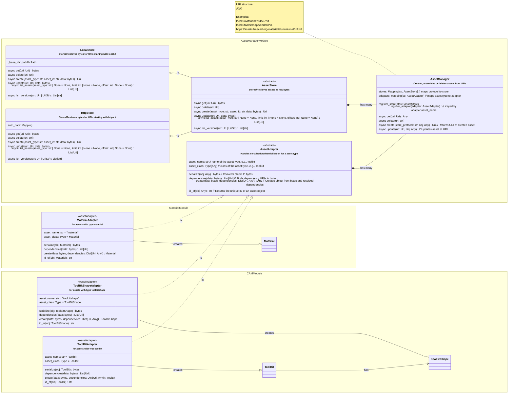

# Asset Management Module

This module implements an asset manager that provides methods for storing,
updating, deleting, and reveiving assets. Assets are arbitrary data.

## API usage example

```python
import asyncio
import pathlib
from Path.Tool.assets import AssetManager, AssetAdapter, LocalStore

class MyAssetAdapter(AssetAdapter):
    asset_name = "myclass"
    def serialize(self, obj: MyClass): return str(obj).encode()
    def dependencies(self, data: bytes): return []  # no dependencies
    def create(self, data: bytes, deps: List[str]): return MyClass(data.decode())

async def main():
    manager = AssetManager()

    # Register LocalStore and the simple adapter
    manager.register_store("local", LocalStore(pathlib.Path("/tmp/assets")))
    manager.register_adapter(SimpleMaterialAdapter())

    # Create and get an asset
    asset_uri = await manager.create("local", Material("Copper"))
    print(f"Stored with URI: {asset_uri}")
    retrieved_asset = await manager.get(asset_uri)
    print(f"Retrieved: {retrieved_asset}")

# To run: asyncio.run(main())
```

## Class diagram


```mermaid
classDiagram
    direction LR

    %% -------------- Asset Manager Module --------------
    note for AssetManager "URI structure:
        <protocol>://<domain>/<asset_type>/<asset>/<version>\?<params><br/>
        Examples:
        local://material/1234567/v1
        local://toolbitshape/endmill/v1
        https:\//assets.freecad.org/material/aluminium-6012/v2"

    class AssetManager["AssetManager
    <small>Creates, assembles or deletes assets from URIs</small>"] {
        stores: Mapping[str, AssetStore]   // maps protocol to store
        adapters: Mapping[str, AssetAdapter]   // maps asset type to adapter
        register_store(store: AssetStore)
        register_adapter(adapter: AssetAdapter) // Keyed by adapter.asset_name
        async get(uri: Uri) Any
        async delete(uri: Uri)
        async create(store_protocol: str, obj: Any) Uri // Returns URI of created asset
        async update(uri: Uri, obj: Any) // Updates asset at URI
    }

    class AssetStore["AssetStore
    <small>Stores/Retrieves assets as raw bytes</small>"] {
        <<abstract>>
        async get(uri: Uri) bytes
        async delete(uri: Uri)
        async create(asset_type: str, asset_id: str, data: bytes) Uri
        async update(uri: Uri, data: bytes)
        async list_assets(asset_type: str | None = None, limit: int | None = None, offset: int | None = None) List[Uri]
        async list_versions(uri: Uri | UriStr) List[str]
    }
    AssetStore *-- AssetManager: has many

    class VersionedLocalStore["LocalStore
    <small>Stores/Retrieves bytes for URIs starting with local://</small>"] {
        _base_dir: pathlib.Path
        async get(uri: Uri) bytes
        async delete(uri: Uri)
        async create(asset_type: str, asset_id: str, data: bytes) Uri
        async update(uri: Uri, data: bytes)
        async list_assets(asset_type: str | None = None, limit: int | None = None, offset: int | None = None) List[Uri]
        async list_versions(uri: Uri | UriStr) List[str]
    }
    VersionedLocalStore <|-- AssetStore: is

    class HttpStore["HttpStore
    <small>Stores/Retrieves bytes for URIs starting with https://</small>"] {
        auth_data: Mapping
        async get(uri: Uri) bytes
        async delete(uri: Uri)
        async create(asset_type: str, asset_id: str, data: bytes) Uri
        async update(uri: Uri, data: bytes)
        async list_assets(asset_type: str | None = None, limit: int | None = None, offset: int | None = None) List[Uri]
        async list_versions(uri: Uri | UriStr) List[str]
    }
    HttpStore <|-- AssetStore: is

    class AssetAdapter["AssetAdapter<br/><small>Handles serialization/deserialization for a asset type</small>"] {
        <<abstract>>
        asset_name: str   // name of the asset type, e.g., toolbit
        asset_class: Type[Any]  // class of the asset type, e.g., ToolBit
        
        serialize(obj: Any) bytes // Converts object to bytes
        dependencies(data: bytes) List[Uri] // Finds dependency URIs in bytes
        create(data: bytes, dependencies: Dict[Uri, Any]) Any // Creates object from bytes and resolved dependencies
        id_of(obj: Any) str // Returns the unique ID of an asset object
    }
    AssetAdapter *-- AssetManager: has many

    namespace AssetManagerModule {
        class AssetManager
        class AssetStore
        class VersionedLocalStore
        class HttpStore
        class AssetAdapter
    }

    %% -------------- CAM Module (as an example) --------------
    class ToolBitShapeAdapter["ToolBitShapeAdapter<br/><small>for assets with type toolbitshape</small>"] {
        <<AssetAdapter>>
        asset_name: str = "toolbitshape"
        asset_class: Type = ToolBitShape
        serialize(obj: ToolBitShape) bytes
        dependencies(data: bytes) List[Uri]
        create(data: bytes, dependencies: Dict[Uri, Any]) ToolBitShape
        id_of(obj: ToolBitShape) str
    }
    ToolBitShapeAdapter --|> ToolBitShape: creates
    ToolBitShapeAdapter ..|> AssetAdapter: is

    class ToolBitAdapter["ToolBitAdapter<br/><small>for assets with type toolbit</small>"] {
        <<AssetAdapter>>
        asset_name: str = "toolbit"
        asset_class: Type = ToolBit
        serialize(obj: ToolBit) bytes
        dependencies(data: bytes) List[Uri]
        create(data: bytes, dependencies: Dict[Uri, Any]) ToolBit
        id_of(obj: ToolBit) str
    }
    ToolBitAdapter --|> ToolBit: creates
    ToolBitAdapter ..|> AssetAdapter: is
    ToolBit --> ToolBitShape: has

    namespace CAMModule {
        class ToolBitShapeAdapter
        class ToolBitAdapter
        class ToolBitShape
        class ToolBit
    }

    %% -------------- Materials Module (as an example) --------------
    class MaterialAdapter["MaterialAdapter<br/><small>for assets with type material</small>"] {
        <<AssetAdapter>>
        asset_name: str = "material"
        asset_class: Type = Material
        serialize(obj: Material) bytes
        dependencies(data: bytes) List[Uri]
        create(data: bytes, dependencies: Dict[Uri, Any]) Material
        id_of(obj: Material) str
    }
    MaterialAdapter --|> Material: creates
    MaterialAdapter ..|> AssetAdapter: is

    namespace MaterialModule {
        class MaterialAdapter
        class Material
    }
```
