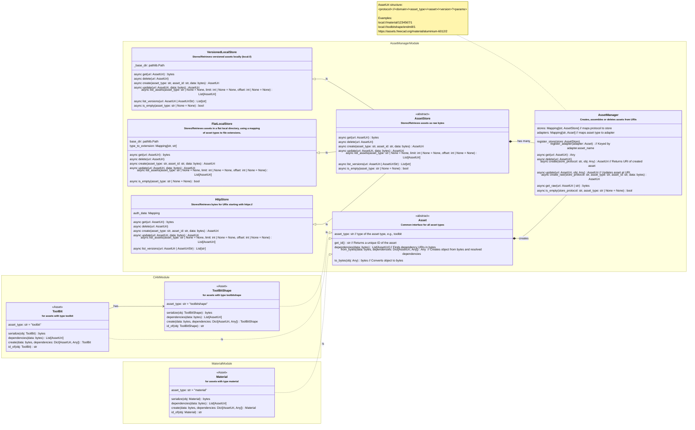

# Asset Management Module

This module implements an asset manager that provides methods for storing,
updating, deleting, and reveiving assets. Assets are arbitrary data.

## API usage example

```python
import asyncio
import pathlib
from typing import Any, Mapping, List, Type
from Path.Tool.assets import AssetManager, VersionedLocalStore, AssetUri, Asset

# Define a simple Material class implementing the Asset interface
class Material(Asset):
    asset_type: str = "material"

    def __init__(self, name: str):
        self.name = name

    @classmethod
    def dependencies(cls, data: bytes) -> List[AssetUri]:
        return []

    @classmethod
    def from_bytes(cls, data: bytes, dependencies: Mapping[AssetUri, Any]) -> Material:
        return cls(data.decode('utf-8'))

    def to_bytes(self) -> bytes:
        return self.name.encode('utf-8')

    def get_id(self) -> str:
        return self.name.lower().replace(" ", "-")


async def main():
    manager = AssetManager()

    # Register VersionedLocalStore and the simple asset class
    manager.register_store(VersionedLocalStore("local", pathlib.Path("/tmp/assets")))
    manager.register_asset(Material)

    # Create and get an asset
    asset_uri = await manager.create("local", Material("Copper"))
    print(f"Stored with URI: {asset_uri}")
    retrieved_asset = await manager.get(asset_uri)
    print(f"Retrieved: {retrieved_asset}")

# To run: asyncio.run(main())
```

## Class diagram


```mermaid
classDiagram
    direction LR

    %% -------------- Asset Manager Module --------------
    note for AssetManager "AssetUri structure:
        &lt;protocol&gt;:\//&lt;domain&gt;/&lt;asset_type&gt;/&lt;asset&gt;/&lt;version&gt;\?&lt;params&gt;<br/>
        Examples:
        local:\//material/1234567/1
        local:\//toolbitshape/endmill/1
        https:\//assets.freecad.org/material/aluminium-6012/2"

    class AssetManager["AssetManager
    <small>Creates, assembles or deletes assets from URIs</small>"] {
        stores: Mapping[str, AssetStore]   // maps protocol to store
        adapters: Mapping[str, Asset]   // maps asset type to adapter
        register_store(store: AssetStore)
        register_adapter(adapter: Asset) // Keyed by adapter.asset_name
        async get(uri: AssetUri) Any
        async delete(uri: AssetUri)
        async create(store_protocol: str, obj: Any) AssetUri // Returns URI of created asset
        async update(uri: AssetUri, obj: Any) AssetUri // Updates asset at URI
        async create_raw(store_protocol: str, asset_type: str, asset_id: str, data: bytes) AssetUri
        async get_raw(uri: AssetUri | str) bytes
        async is_empty(store_protocol: str, asset_type: str | None = None) bool
    }

    class AssetStore["AssetStore
    <small>Stores/Retrieves assets as raw bytes</small>"] {
        <<abstract>>
        async get(uri: AssetUri) bytes
        async delete(uri: AssetUri)
        async create(asset_type: str, asset_id: str, data: bytes) AssetUri
        async update(uri: AssetUri, data: bytes) AssetUri
        async list_assets(asset_type: str | None = None, limit: int | None = None, offset: int | None = None) List[AssetUri]
        async list_versions(uri: AssetUri | AssetUriStr) List[str]
        async is_empty(asset_type: str | None = None) bool
    }
    AssetStore *-- AssetManager: has many

    class VersionedLocalStore["VersionedLocalStore
    <small>Stores/Retrieves versioned assets locally (local://)</small>"] {
        _base_dir: pathlib.Path
        async get(uri: AssetUri) bytes
        async delete(uri: AssetUri)
        async create(asset_type: str, asset_id: str, data: bytes) AssetUri
        async update(uri: AssetUri, data: bytes) AssetUri
        async list_assets(asset_type: str | None = None, limit: int | None = None, offset: int | None = None) List[AssetUri]
        async list_versions(uri: AssetUri | AssetUriStr) List[str]
        async is_empty(asset_type: str | None = None) bool
    }
    VersionedLocalStore <|-- AssetStore: is

    class FlatLocalStore["FlatLocalStore
    <small>Stores/Retrieves assets in a flat local directory, using a mapping
    of asset types to file extensions.</small>"] {
        base_dir: pathlib.Path
        type_to_extension: Mapping[str, str]
        async get(uri: AssetUri) bytes
        async delete(uri: AssetUri)
        async create(asset_type: str, asset_id: str, data: bytes) AssetUri
        async update(uri: AssetUri, data: bytes) AssetUri
        async list_assets(asset_type: str | None = None, limit: int | None = None, offset: int | None = None) List[AssetUri]
        async is_empty(asset_type: str | None = None) bool
    }
    FlatLocalStore <|-- AssetStore: is

    class HttpStore["HttpStore
    <small>Stores/Retrieves bytes for URIs starting with https://</small>"] {
        auth_data: Mapping
        async get(uri: AssetUri) bytes
        async delete(uri: AssetUri)
        async create(asset_type: str, asset_id: str, data: bytes) AssetUri
        async update(uri: AssetUri, data: bytes) AssetUri
        async list_assets(asset_type: str | None = None, limit: int | None = None, offset: int | None = None) List[AssetUri]
        async list_versions(uri: AssetUri | AssetUriStr) List[str]
    }
    HttpStore <|-- AssetStore: is

    class Asset["Asset<br/><small>Common interface for all asset types</small>"] {
        <<abstract>>
        asset_type: str  // type of the asset type, e.g., toolbit
        
        get_id() str  // Returns a unique ID of the asset
        dependencies(data: bytes) List[AssetUri]  // Finds dependency URIs in bytes
        from_bytes(data: bytes, dependencies: Dict[AssetUri, Any]) Any  // Creates object from bytes and resolved dependencies
        to_bytes(obj: Any) bytes // Converts object to bytes
    }
    Asset *-- AssetManager: creates

    namespace AssetManagerModule {
        class AssetManager
        class AssetStore
        class VersionedLocalStore
        class FlatLocalStore
        class HttpStore
        class Asset
    }

    %% -------------- CAM Module (as an example) --------------
    class ToolBitShape["ToolBitShape<br/><small>for assets with type toolbitshape</small>"] {
        <<Asset>>
        asset_type: str = "toolbitshape"

        serialize(obj: ToolBitShape) bytes
        dependencies(data: bytes) List[AssetUri]
        create(data: bytes, dependencies: Dict[AssetUri, Any]) ToolBitShape
        id_of(obj: ToolBitShape) str
    }
    ToolBitShape ..|> Asset: is

    class ToolBit["ToolBit<br/><small>for assets with type toolbit</small>"] {
        <<Asset>>
        asset_type: str = "toolbit"

        serialize(obj: ToolBit) bytes
        dependencies(data: bytes) List[AssetUri]
        create(data: bytes, dependencies: Dict[AssetUri, Any]) ToolBit
        id_of(obj: ToolBit) str
    }
    ToolBit ..|> Asset: is
    ToolBit --> ToolBitShape: has

    namespace CAMModule {
        class ToolBitShape
        class ToolBit
    }

    %% -------------- Materials Module (as an example) --------------
    class Material["Material<br/><small>for assets with type material</small>"] {
        <<Asset>>
        asset_type: str = "material"

        serialize(obj: Material) bytes
        dependencies(data: bytes) List[AssetUri]
        create(data: bytes, dependencies: Dict[AssetUri, Any]) Material
        id_of(obj: Material) str
    }
    Material ..|> Asset: is

    namespace MaterialModule {
        class Material
        class Material
    }
```
