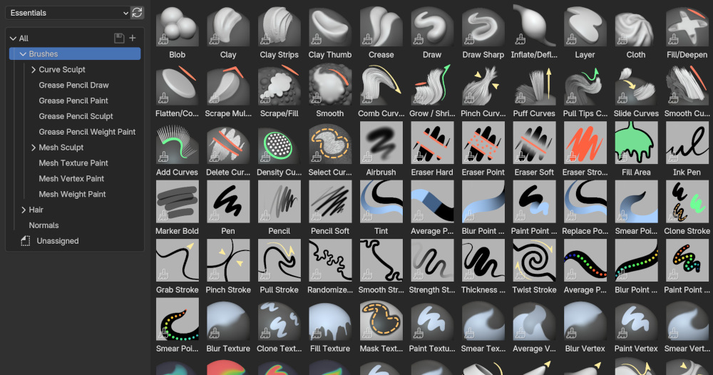

# Asset Management Module

This module implements an asset manager that provides methods for storing,
updating, deleting, and receiving assets for the FreeCAD CAM workbench.

## Goals of the asset manager

While currently the AssetManager has no UI yet, the plan is to add one.

The ultimate vision for the asset manager is to provide a unified UI that
can download assets from arbitrary sources, such as online databases,
Git repositories, and also local storage. It should also allow for copying
between these storages, effectively allowing for publishing assets.

Essentially, something similar to what Blender has:



### What are assets in CAM?

Assets are arbitrary data, such as FreeCAD models, Tools, and many more.
Specifically in the context of CAM, assets are:

- Tool bit libraries
- Tool bits
- Tool bit shape files
- Tool bit shape icons
- Machines
- Fixtures
- Post processors
- ...

**Assets have dependencies:** For example, a ToolBitLibrary requires ToolBits,
and a ToolBit requires a ToolBitShape (which is a FreeCAD model).


## Development

The biggest challenge was that all CAM objects are big monoliths that
handle everything: in-memory data, serialization, storage. They are
tightly coupled to files, and make assumptions about how other objects
are stored.

Examples:

- Tool bits have "File" attributes that they use to collect dependencies
  such as ToolBit files and shape files.
- GuiToolBit has serialization code directly in UI functions

### Progress

The main effort went into two key areas:

1. **The generic AssetManager:**
    - **Manages dependencies** including detection of cyclic dependencies
    - **Manages storage** while existing FreeCAD tool library file structures retained
    - **Manages threading** for asynchronous storage, while FreeCAD objects are assembled in the main UI thread
    - **Defining a generic asset interface** that classes can implement to become "storable"

2. **Refactoring exiting CAM objects for clear separation of concerns:**
    - **View**: Should handle user interface only. I removed existing file system access methods, but went minimally invasive here, so the UI code is largely unchanged. There is still legacy code left.
    - **Object Model**: In-memory representation of an object, for example a ToolBit, Icon, or a ToolBitShape. I finished the work of for ToolBitShape and icons by giving them `from_bytes()` and `to_bytes()` methods; the objects do no longer need to know where they are stored.
    - **Serialization** A serialization protocol needs to be defined. This will allow for better import/export mechanisms in the future
    - **Storage**: Persisting an object to a file system or database

FreeCAD is now fully usable with the changes in place, but only ToolBitShape and icons are managed by the AssetManager.

### What's next

- ToolBits need to be refactored for better separation of concerns.
- Library objects need to adopt the Asset interface

At that point, the storage of existing objects would be complete and unified.


### Potential future extensions

- Adding a generic AssetManager UI, to allow for browsing and searching stores for all kinds of assets (Machines, Fixtures, Libraries, Tools, Shapes, Post Processors, ...).
- Adding a GitStore, to connect to things like the FreeCAD library.
- Adding an HttpStore for connectivity to online databases.


## API usage example

```python
import pathlib
from typing import Any, Mapping, List, Type
from Path.Tool.assets import AssetManager, FileStore, AssetUri, Asset

# Define a simple Material class implementing the Asset interface
class Material(Asset):
    asset_type: str = "material"

    def __init__(self, name: str):
        self.name = name

    def get_id() -> str:
        return self.name.lower().replace(" ", "-")

    @classmethod
    def dependencies(cls, data: bytes) -> List[AssetUri]:
        return []

    @classmethod
    def from_bytes(cls, data: bytes, id: str, dependencies: Mapping[AssetUri, Any]) -> Material:
        return cls(data.decode('utf-8'))

    def to_bytes(self) -> bytes:
        return self.name.encode('utf-8')

manager = AssetManager()

# Register FileStore and the simple asset class
manager.register_store(FileStore("local", pathlib.Path("/tmp/assets")))
manager.register_asset(Material)

# Create and get an asset
asset_uri = manager.create(Material("Copper"))
print(f"Stored with URI: {asset_uri}")
retrieved_asset = manager.get(asset_uri)
print(f"Retrieved: {retrieved_asset}")
```

## Class diagram


```mermaid
classDiagram
    direction LR

    %% -------------- Asset Manager Module --------------
    note for AssetManager "AssetUri structure:
        &lt;asset_type&gt;:\//&lt;asset_id&gt;[/&lt;version&gt;]<br/>
        Examples:
        material:\//1234567/1
        toolbitshape:\//endmill/1
        material:\//aluminium-6012/2"

    class AssetManager["AssetManager
    <small>Creates, assembles or deletes assets from URIs</small>"] {
        stores: Mapping[str, AssetStore]   // maps protocol to store
        _asset_classes: Mapping[str, Asset]   // maps asset type to Asset
        register_store(store: AssetStore)
        register_asset(asset: Asset) // Keyed by adapter.asset_name
        get(uri: AssetUri, store: str) Any
        delete(uri: AssetUri, store: str)
        create(obj: Any, store: str) AssetUri // Returns URI of created asset
        update(uri: AssetUri, obj: Any, store: str) AssetUri // Updates asset at URI
        create_raw(asset_type: str, asset_id: str, data: bytes, store: str) AssetUri
        get_raw(uri: AssetUri | str, store: str) bytes
        is_empty(store: str | None, asset_type: str | None) bool
        list_assets(asset_type: str | None, limit: int | None, offset: int | None, store: str) List[AssetUri]
        list_versions(uri: AssetUri | str, store: str) List[AssetUri]
        get_bulk(uris: List[AssetUri | str], store: str) Dict[AssetUri, Any]
        fetch(asset_type: str | None, limit: int | None, offset: int | None, store: str) List[Asset]
    }

    class AssetStore["AssetStore
    <small>Stores/Retrieves assets as raw bytes</small>"] {
        <<abstract>>
        async get(uri: AssetUri) bytes
        async delete(uri: AssetUri)
        async create(asset_type: str, asset_id: str, data: bytes) AssetUri
        async update(uri: AssetUri, data: bytes) AssetUri
        async list_assets(asset_type: str | None, limit: int | None, offset: int | None) List[AssetUri]
        async list_versions(uri: AssetUri) List[AssetUri]
        async is_empty(asset_type: str | None) bool
    }
    AssetStore *-- AssetManager: has many

    class FileStore["FileStore
    <small>Stores/Retrieves versioned assets as directories/files</small>"] {

        __init__(name: str, filepath: pathlib.Path)
        set_dir(new_dir: pathlib.Path)
        async get(uri: AssetUri) bytes
        async delete(uri: AssetUri)
        async create(asset_type: str, asset_id: str, data: bytes) AssetUri
        async update(uri: AssetUri, data: bytes) AssetUri
        async list_assets(asset_type: str | None, limit: int | None, offset: int | None) List[AssetUri]
        async list_versions(uri: AssetUri) List[AssetUri]
        async is_empty(asset_type: str | None) bool
    }
    FileStore <|-- AssetStore: is

    class FlatFileStore["FlatFileStore
    <small>Stores/Retrieves assets in a flat local directory, using a mapping
    of asset types to file extensions.</small>"] {
        __init__(name: str, filepath: pathlib.Path, type_to_extension: Mapping[str, str])
        set_dir(new_dir: pathlib.Path)
        async get(uri: AssetUri) bytes
        async delete(uri: AssetUri)
        async create(asset_type: str, asset_id: str, data: bytes) AssetUri
        async update(uri: AssetUri, data: bytes) AssetUri
        async list_assets(asset_type: str | None, limit: int | None, offset: int | None) List[AssetUri]
        async list_versions(uri: AssetUri) List[AssetUri]
        async is_empty(asset_type: str | None) bool
    }
    FlatFileStore <|-- AssetStore: is

    class MemoryStore["MemoryStore
    <small>In-memory store, mostly for testing/demonstration</small>"] {
        __init__(name: str)
        async get(uri: AssetUri) bytes
        async delete(uri: AssetUri)
        async create(asset_type: str, asset_id: str, data: bytes) AssetUri
        async update(uri: AssetUri, data: bytes) AssetUri
        async list_assets(asset_type: str | None, limit: int | None, offset: int | None) List[AssetUri]
        async list_versions(uri: AssetUri) List[AssetUri]
        async is_empty(asset_type: str | None) bool
        dump(print: bool) Dict | None
    }
    MemoryStore <|-- AssetStore: is

    class Asset["Asset<br/><small>Common interface for all asset types</small>"] {
        <<abstract>>
        asset_type: str  // type of the asset type, e.g., toolbit
        
        get_id() str  // Returns a unique ID of the asset
        to_bytes() bytes // Converts object to bytes
        from_bytes(data: bytes, id: str, dependencies: Mapping[AssetUri, Any]) Any  // Creates object from bytes and resolved dependencies
        dependencies(data: bytes) List[AssetUri]  // Finds dependency URIs in bytes
    }
    Asset *-- AssetManager: creates

    namespace AssetManagerModule {
        class AssetManager
        class AssetStore
        class FileStore
        class FlatFileStore
        class MemoryStore
        class Asset
    }

    %% -------------- CAM Module (as an example) --------------
    class ToolBitShape["ToolBitShape<br/><small>for assets with type toolbitshape</small>"] {
        <<Asset>>
        asset_type: str = "toolbitshape"

        get_id() str  // Returns a unique ID
        from_bytes(data: bytes, id: str, dependencies: Dict[AssetUri, Any]) ToolBitShape
        to_bytes(obj: ToolBitShape) bytes
        dependencies(data: bytes) List[AssetUri]
    }
    ToolBitShape ..|> Asset: is

    class ToolBit["ToolBit<br/><small>for assets with type toolbit</small>"] {
        <<Asset>>
        asset_type: str = "toolbit"

        get_id() str  // Returns a unique ID
        from_bytes(data: bytes, id: str, dependencies: Dict[AssetUri, Any]) ToolBit
        to_bytes(obj: ToolBit) bytes
        dependencies(data: bytes) List[AssetUri]
    }
    ToolBit ..|> Asset: is
    ToolBit --> ToolBitShape: has

    namespace CAMModule {
        class ToolBitShape
        class ToolBit
    }

    %% -------------- Materials Module (as an example) --------------
    class Material["Material<br/><small>for assets with type material</small>"] {
        <<Asset>>
        asset_type: str = "material"

        get_id() str  // Returns a unique ID
        dependencies(data: bytes) List[AssetUri]
        from_bytes(data: bytes, id: str, dependencies: Dict[AssetUri, Any]) Material
        to_bytes(obj: Material) bytes
    }
    Material ..|> Asset: is

    namespace MaterialModule {
        class Material
        class Material
    }
```
