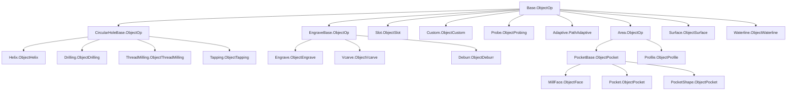

# Requirements
## 🟩 Core Essentials
Features Necessary to do perform the required function
- Calculate motion paths
- Specify entry/exit strategies
- Configure key operation Parameters
	- stepdown/stepover
	- spindle speed
	- feed rate
- Tool selection
- Configure Specific machining tasks
	- pocketing
	- drilling
	- contouring (profiling)
	- Engraving

## 🟨 Professional Grade
Features present in the state-of-the art applications and expected
- Optimize toolpath for efficiency
- Configure REST milling for subsequent operations
	- Tapping
	- threadmilling
	- Vcarving
	- Deburring
	- Helical clearing
	- Adaptive clearing
- Lathe operations
- Indexed Multi-Axis operations
- Continuous 4th and 5th Axis

## 🟦 Next-Level CAM
Features that would exceed industry standard

# [topic name placeholder]

Operations represent the core of the CAM workbench.  They hold most of the complexity and a majority of the actual source code.  To manage this code and complexity, the operation logic is broken into several logical parts.  The implementation of this abstraction is inconsistent.

## The Operation Object Hierarchy

Base.ObjectOp
	CircularHoleBase.ObjectOp
		Helix.ObjectHelix
		Drilling.ObjectDrilling
		ThreadMilling.ObjectThreadMilling
		Tapping.ObjectTapping
	EngraveBase.ObjectOp
		Engrave.ObjectEngrave
		Vcarve.ObjectVcarve
		Deburr.ObjectDeburr
	Slot.ObjectSlot
    Custom.ObjectCustom
    Probe.ObjectProbing
	Adaptive.PathAdaptive
	Area.ObjectOp
        PocketBase.ObjectPocket
            MillFace.ObjectFace
            Pocket.ObjectPocket
            PocketShape.ObjectPocket
        Profile.ObjectProfile
    Surface.ObjectSurface
    Waterline.ObjectWaterline

Notes:
- The three big groups, CircularHoleBase, EngraveBase, and PocketBase can be thought of as working on points, wires, and planar faces respectively.  (In actuality, CircularHolebase works on an edge aligned with the spindle)
- Area is the oddball. It is a legacy abstraction and could be refactored out.
- Surface and Waterline are both OCL-based operations and work on faces, including curved faces.  They should be refactored to inherit from a common SurfaceBase
- Adaptive should be refactored as a strategy of pocket.
- Slot has extensive logic to calculate the appropriate wire but otherwise
  works on a wire.  It could be refactored to inherit from EngraveBase

## GUI
The user facing logic when running the FreeCAD GUI.  The GUI is responsible for managing the state of the taskpanels and responding to user actions.
All other logic should reside in the operation.  It also contains the ViewProvider of the operation which renders the Path Commands in the scenegraph.

### GUI object Hierarchy
Base.TaskPanelPage
    CircularHoleBaseGui.TaskPanelOpPage
        Helix.TaskPanelOpPage
        Tapping.TaskPanelOpPage
        ThreadMilling.TaskPanelOpPage
    PocketBaseGui.TaskPanelOpPage
        MillFace
        PocketShape
        Pocket
    Adaptive.TaskPanelOpPage
    Custom.TaskPanelOpPage
    Deburr.TaskPanelOpPage
    Drilling.TaskPanelOpPage
    Engrave.TaskPanelOpPage
    Probe.TaskPanelOpPage
    Vcarve.TaskPanelOpPage
    Waterline.TaskPanelOpPage
    Slot.TaskPanelOpPage
    Profile.TaskPanelOpPage
    Surface.TaskPanelOpPage
    FeatureExtension.TaskPanelExtensionPage
Base.TaskPanelBaseGeometryPage
    Deburr.TaskPanelBaseGeometryPage
    Engrave.TaskPanelBaseGeometryPage
    Vcarve.TaskPanelBaseGeometryPage

```mermaid
graph TD
    Base.TaskPanelPage
    Base.TaskPanelBaseGeometryPage

    Base.TaskPanelPage --> CircularHoleBaseGui.TaskPanelOpPage
    CircularHoleBaseGui.TaskPanelOpPage --> Helix.TaskPanelOpPage
    CircularHoleBaseGui.TaskPanelOpPage --> Tapping.TaskPanelOpPage
    CircularHoleBaseGui.TaskPanelOpPage --> ThreadMilling.TaskPanelOpPage

    Base.TaskPanelPage --> PocketBaseGui.TaskPanelOpPage
    PocketBaseGui.TaskPanelOpPage --> MillFace
    PocketBaseGui.TaskPanelOpPage --> PocketShape
    PocketBaseGui.TaskPanelOpPage --> Pocket

    Base.TaskPanelPage --> Adaptive.TaskPanelOpPage
    Base.TaskPanelPage --> Custom.TaskPanelOpPage
    Base.TaskPanelPage --> Deburr.TaskPanelOpPage
    Base.TaskPanelPage --> Drilling.TaskPanelOpPage
    Base.TaskPanelPage --> Engrave.TaskPanelOpPage
    Base.TaskPanelPage --> Probe.TaskPanelOpPage
    Base.TaskPanelPage --> Vcarve.TaskPanelOpPage
    Base.TaskPanelPage --> Waterline.TaskPanelOpPage
    Base.TaskPanelPage --> Slot.TaskPanelOpPage
    Base.TaskPanelPage --> Profile.TaskPanelOpPage
    Base.TaskPanelPage --> Surface.TaskPanelOpPage
    Base.TaskPanelPage --> FeatureExtension.TaskPanelExtensionPage

    Base.TaskPanelBaseGeometryPage --> Deburr.TaskPanelBaseGeometryPage
    Base.TaskPanelBaseGeometryPage --> Engrave.TaskPanelBaseGeometryPage
    Base.TaskPanelBaseGeometryPage --> Vcarve.TaskPanelBaseGeometryPage
```

Notes: 
 - Array.py is non-standard and should be refactored or eliminated
 - Comment.py is non-standard and should be refactored or eliminated
 - Copy.py is non-standard and should be refactored or eliminated
 - Stop.py is non-standard and should be refactored or eliminated
 - PathShapeTC is non-standard and should be refactored or eliminated
 - SimpleCopy is non-standard and should be refactored or eliminated

### Command
User-facing functionality is triggered by a GUI command that is registered when the workbench is activated.  The commands should be 

### Task Panel
The task panel is the primary place where a user interacts with the operation.
Task panels should be carefully designed and reviewed with DWG.
Not all operation properties need to be exposed through task panels.  It is perfectly acceptable to keep seldom-used or advanced feature properties only accessible through the property pane.
This has the benefit of keeping the task panels clean and efficient while providing advanced users a what to fine tune operations.

## Operation
The operation is responsible for managing the state (properties) of the operation and calculating the Path Commands. Specifically,
it 

- manages the targets (geometry to be acted upon). Determines the order to act
  on them.
- Calculates the linking moves to position the cutter in each target
- Computes the cutting moves to act on the target (using generators, helpers,
  libraries)
- Moves the cutter to an appropriate location at the end of the last cutting
  move.

## Generator

Generators are low-level functions that compute the cutting moves for a single target.
They have no user interface and are implemented as pure functions.  
Generators should have 100% test coverage at all times because they may be called from multiple operation contexts.

For example, creating a helical move may be done
- By the helix operation
- As an entry move to a pocketing operation

### Current Generators
- Drill Generator (Generates canned cycle drilling commands)
- Helix
- Rotation
- Tapping
- threadmilling
- toolchange
- dogboneII

### Needed Generators
- Pocket (zigzag)
- Pocket (adaptive)
- Pocket (offset)
- Line
- Linking
- vcarve

## Dressup

