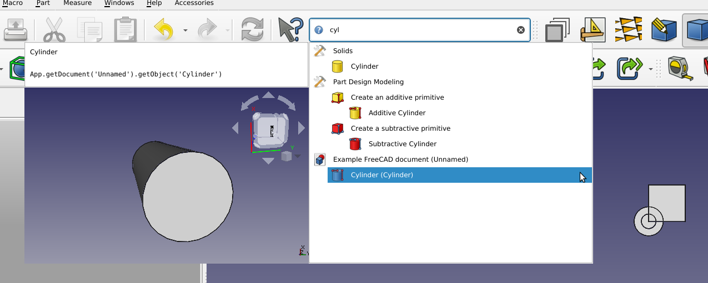
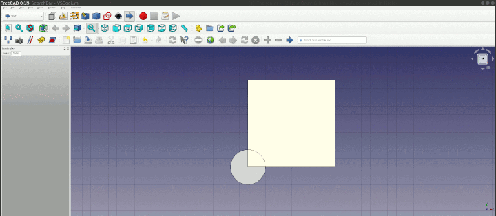

## FreeCAD SearchBar

This FreeCAD mod adds a search bar for tools, document objects and preferences.

⚠️ Several issues related to the C++ memory management interacting badly with Python's have caused lots of segfaults during development. ⚠️

⚠️️ Most of these should now be solved, but save your work often and proceed with caution while testing this extension. ⚠️

### Extensibility

It can be extended by other mods, by adding a new result provider.

### Usage

The search bar appears next to the [`What's this?`](https://wiki.freecad.org/Std_WhatsThis) tool  in FreeCAD's default File toolbar.

When using the search bar for the first time, it will contain only the tools of the workbenches which have already been loaded in FreeCAD.
To include results from other workbenches, select the first search result "Refresh list of tools" which will load all FreeCAD workbenches
and memorize their tools. After restarting FreeCAD, the search result will include the memorized tools, even if the workbenches have not
been loaded yet. When selecting a tool from the search results, SearchBar will attempt to automatically load the workbenches which could
have provided that tool.

To navigate the search results, use the up and down arrows. Typing characters will filter the results on the fly. The extended information
panel next to the search results provides further documentation about the results, e.g. Python snippets which can be copy-pasted (note:
currently a bug crashes FreeCAD if using the context menu to perform the copy, please do not use the context menu until
https://github.com/SuzanneSoy/SearchBar/issues/12 is fixed.

### Installation

#### Automatic Install

Install **SearchBar** addon via the FreeCAD Addon Manager from the **Tools** :arrow_right: **Addon Manager** dropdown menu. 

#### Manual Install

Expand for instructions on manual installation of SearchBar

Clone the GIT repository or extract the `.zip` downloaded from GitHub to the following location:
  * Linux: `~/.FreeCAD/Mod/SearchBar`
  * macOS: `/Users/user_name/Library/Preferences/FreeCAD/Mod/SearchBar`
  * Windows: `C:\Users\user_name\AppData\Roaming\FreeCAD\Mod\SearchBar`

### Uninstallation

* Remove the folder which was cloned during installation:
  * Linux: `~/.FreeCAD/Mod/SearchBar`
  * macOS: `/Users/user_name/Library/Preferences/FreeCAD/Mod/SearchBar`
  * Windows: `C:\Users\user_name\AppData\Roaming\FreeCAD\Mod\SearchBar`
* Optional: Remove the cache (\~30MB) `\~/.FreeCAD/Cache_SearchBarMod` or equivalent on other platforms

### Development

* `InitGui.py` adds an instance of `SearchBoxLight` to the GUI.
* `SearchBoxLight` is a hollowed-out implementation of a search box, it loads everything lazily.

### Feedback

To report bugs or feature enhancements, please open a ticket in the [issue queue](https://github.com/SuzanneSoy/SearchBar/issues). Best place to discuss feedback or issues in on the [dedicated FreeCAD forum discussion]() for SearchBar. 

### License 
See [LICENSE](LICENSE).
This repository is in the public domain.
